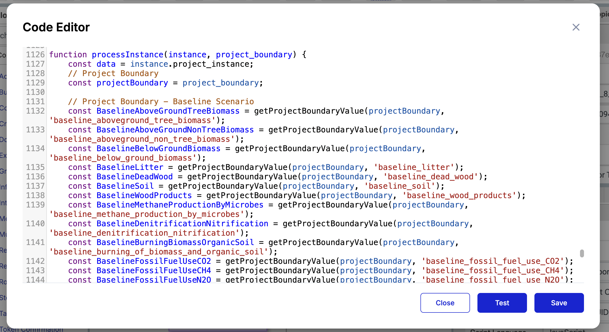
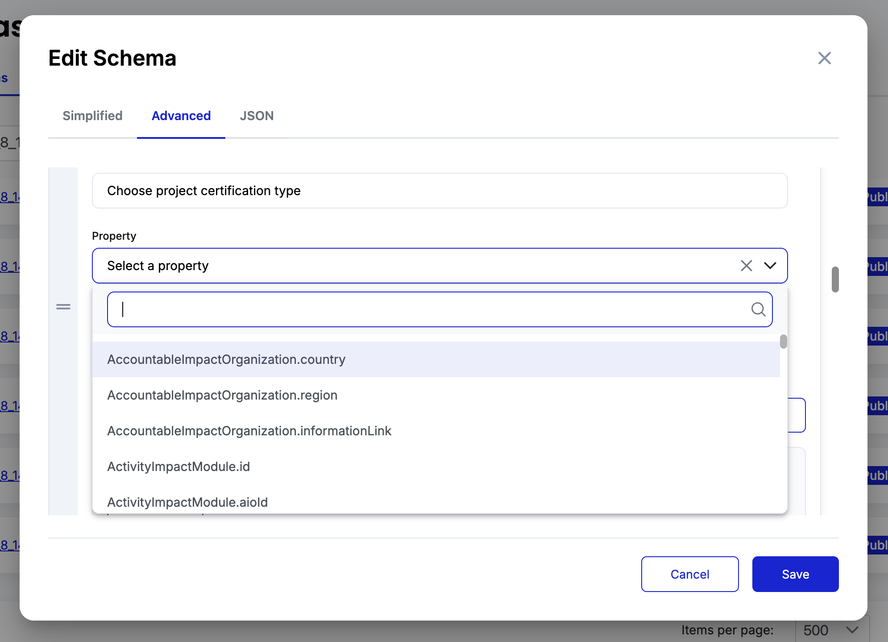
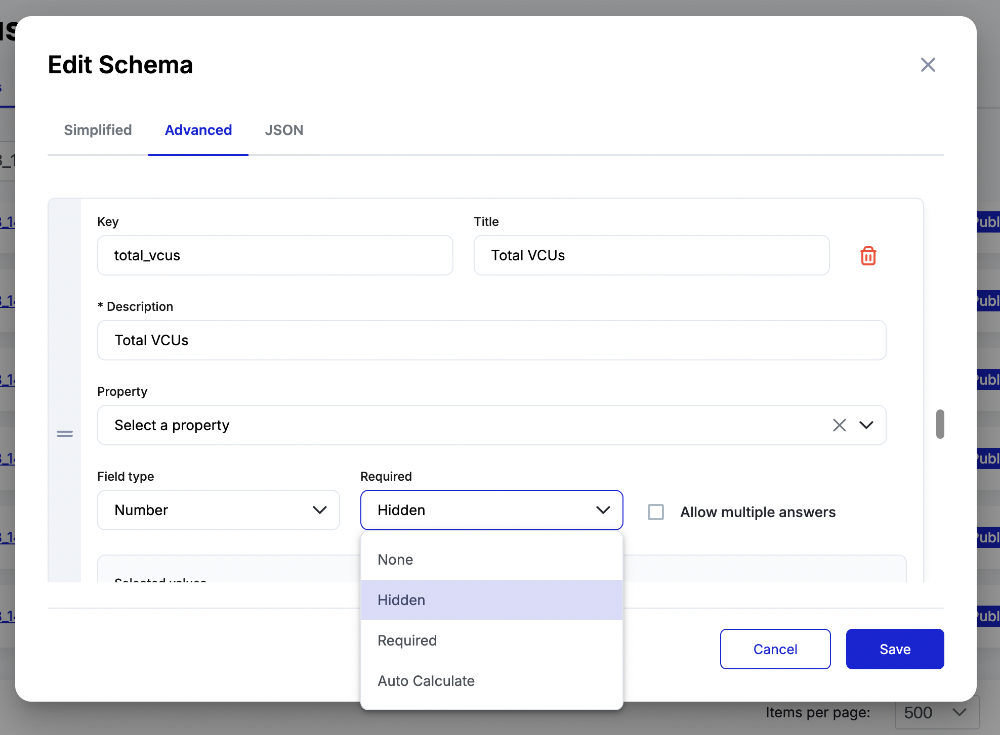
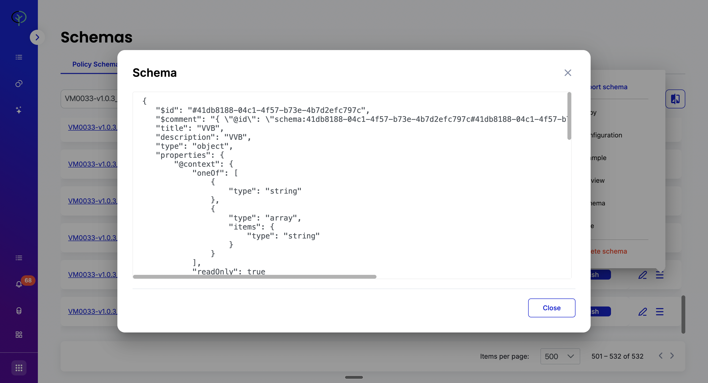

# Chapter 11: Advanced Schema Techniques

This chapter covers essential advanced techniques for schema management that extend beyond the Excel-first approach. You'll learn API-based schema operations, field properties, the four Required field types, and UUID management for efficient schema development.

These techniques are crucial for efficient schema management, especially when working with complex methodologies or managing multiple schemas across policies.

## API-Based Schema Management

While Excel-first approach works well for initial development, API operations become essential for schema updates, bulk operations, and automated workflows. Guardian provides comprehensive schema APIs for create, read, update, and delete operations.

### When to Use Schema APIs

**API operations are essential for**:
- **Schema Updates**: Modifying existing schemas without rebuilding from Excel
- **Bulk Operations**: Managing multiple schemas across different policies
- **Integration**: Connecting schema management to external workflows
- **Field Key Updates**: Programmatically renaming field keys for better calculation code

For detailed API operations, see [Schema Creation Using APIs](../../../guardian/standard-registry/schemas/schema-creation-using-apis/).

## Importance of Good Key Names

Field key names are crucial for calculation code readability and maintenance. Good key names become especially important when schemas are used in complex calculations and policy workflows.

### Field Key Naming Best Practices

**Good Field Keys**:
- `biomass_density_stratum_i` - Clear parameter identification
- `carbon_stock_baseline_t` - Indicates baseline value at time t
- `emission_reduction_annual` - Descriptive of calculation purpose
- `area_hectares_total` - Clear units and scope

**Poor Field Keys**:
Keep in mind that excel imports result in default cell IDs set as key names -
- `field0`, `field1` - No semantic meaning
- `biomassDensity` - Lacks context (which stratum? units?)
- `carbonStock` - Ambiguous (baseline? project? which period?)
- `G5`, `G182`, `data`, `value`, `amount` - Generic and meaningless

**Impact on Calculation Code**:
```javascript
// With good field keys - self-documenting
const totalEmissions = (
  data.biomass_density_stratum_i * data.area_hectares_stratum_i *
  data.carbon_fraction_tree * data.co2_conversion_factor
);

// With poor field keys - requires comments and documentation
const totalEmissions = (
  data.field0 * data.field1 * data.field2 * data.G5
); // What calculation is this performing?
```



## Standardized Property Definitions

Guardian's Property Glossary provides standardized data definitions based on the GBBC dMRV Specification that ensure data consistency and comparability across different methodologies and projects. These standardized properties enable interoperability and universal data mapping.

### Understanding Standardized Properties

For complete property definitions, see [Available Schema Types](../../../guardian/standard-registry/schemas/available-schema-types.md) and [Property Glossary](../../../guardian/standard-registry/schemas/property-glossary.md).

**Purpose of Standardized Properties**:
- **Data Consistency**: Ensure uniform interpretation of data across different methodology schemas
- **Cross-Methodology Comparability**: Enable comparison of projects using different methodologies
- **Enhanced Searchability**: Allow efficient data retrieval across the Guardian ecosystem
- **GBBC Compliance**: Align with industry-standard dMRV specifications



### Key Standardized Property Categories

**Organization Properties**:
- `AccountableImpactOrganization`: Project developers and responsible entities
- `Signatory`: Agreement signatories with defined roles (IssuingRegistry, ValidationAndVerificationBody, ProjectOwner, VerificationPlatformProvider)
- `Address`: Standardized address format with addressType, city, state, country

**Project Properties**:
- `ActivityImpactModule`: Core project information including classification (Carbon Avoidance/Reduction/Removal)
- `GeographicLocation`: Standardized location data with longitude, latitude, geoJsonOrKml
- `MitigationActivity`: Mitigation activity classification and methods

**Credit Properties**:
- `CRU` (Carbon Reduction Unit): Standardized carbon credit structure with quantity, unit, vintage, status
- `REC` (Renewable Energy Certificate): Renewable energy certificate format with recType, validJurisdiction
- `CoreCarbonPrinciples`: Core carbon principles compliance including generationType, verificationStandard

**Verification Properties**:
- `Validation`: Standardized validation structure with validationDate, validatingPartyId, validationMethod
- `VerificationProcessAgreement`: Verification agreements with signatories, qualityStandard, mrvRequirements
- `Attestation`: Attestation structure with attestor, signature, proofType

### Using Standardized Properties in Schemas

**Example: Geographic Location Implementation**:
```excel
Row 5: Yes | Object | | | Project Location | No |
```

Using standardized `GeographicLocation` structure:
- `longitude` (string): Longitude coordinate
- `latitude` (string): Latitude coordinate
- `geoJsonOrKml` (string): Geographic boundary data
- `geographicLocationFile` (file): Additional location documentation

**Example: Carbon Credit Implementation**:
```excel
Row 10: Yes | Object | | | Carbon Credits | No |
```

Using standardized `CRU` structure:
- `quantity` (string): Amount of credits
- `unit` (enum): CO₂e or other unit specification
- `vintage` (string): Year of emission reduction
- `status` (enum): Credit status (Active, Retired, etc.)
- `coreCarbonPrinciples` (object): Core carbon principles compliance

### Benefits of Standardized Properties

**Cross-Methodology Interoperability**:
Projects can transition between methodologies while preserving core data structure:
```
VM0033 Project → Standard Properties → Different Methodology
  GeographicLocation ✓
  AccountableImpactOrganization ✓
  CRU (Carbon Credits) ✓
  Validation Records ✓
```

**Registry Aggregation**: Registries can aggregate and compare data from different methodology implementations using consistent property structures.

**Automated Quality Control**: Standardized properties include built-in validation rules ensuring data consistency and preventing incomplete submissions.

## Four Types of Required Field Settings

Guardian provides four distinct Required field settings that control field behavior and visibility. Understanding these types is crucial for proper schema design.



### Required Field Types

#### 1. None
- **Behavior**: Optional field, visible to users
- **Use Case**: Optional project information, supplementary data
- **Example**: `project_website_url`, `additional_notes`

```excel
Row 5: None | String | | | Project website (optional) | No | https://example.com
```

#### 2. Hidden
- **Behavior**: Not visible to users, used for system data or autocalculatable fields where expression is defined within custom logic block
- **Use Case**: Net VCUs, baseline emission final calculations
- **Example**: `net_VCUs_to_mint`, `baseline_emissions_tCO2e`, `project_crediting_period`

```excel
Row 8: Hidden | String | | Hidden | Internal project reference | No | PROJ-2024-001
```

#### 3. Required
- **Behavior**: Must be completed by users before submission
- **Use Case**: Essential project data, regulatory requirements
- **Example**: `project_title`, `project_developer`, `start_date`

```excel
Row 3: Required | String | | | Project title | No | VM0033 Wetland Project
```

#### 4. Auto Calculate
- **Behavior**: Not visible to users, calculated automatically
- **Use Case**: LHS parameters of equations, intermediate calculation results
- **Assignment**: Must be assigned via expression field or custom logic block

```excel
Row 12: Auto Calculate | Number | | | Total emission reductions (t CO2e) | No | 150.5
```

### Auto Calculate Field Details

Auto Calculate fields are essential for methodology calculations but require special handling:

**Purpose**:
- Store Left-Hand Side (LHS) parameters of methodology equations
- Hold intermediate calculation results for complex formulas
- Maintain calculated values for audit trails and verification

**Assignment Methods**:
1. **Expression Field**: Set calculation formula directly in schema UI. Note that via UI, you'd only be able to access variables within that particular schema. Subschema or other schema variables won't be available.
2. **Custom Logic Block**: Assign values through policy calculation blocks, this is the most powerful and comprehensive approach so far.

**Auto Calculate Example**:
```excel
Row 10: AutoCalculate | Number | | | Baseline emissions annual (t CO2e) | No |
Row 11: AutoCalculate | Number | | | Project emissions annual (t CO2e) | No |
Row 12: AutoCalculate | Number | | | Net emission reductions (t CO2e) | No |
```

**Calculation Assignment**:
```javascript
// In custom logic block
const baselineEmissions = calculateBaselineEmissions(data);
const projectEmissions = calculateProjectEmissions(data);
const netReductions = baselineEmissions - projectEmissions;

// Assign to Auto Calculate fields
outputs.baseline_emissions_annual = baselineEmissions;
outputs.project_emissions_annual = projectEmissions;
outputs.net_emission_reductions = netReductions;
```

## Schema UUIDs and Efficient Development

Every Guardian schema receives a unique identifier (UUID) when created. Understanding and leveraging schema UUIDs enables efficient development workflows, especially for large-scale policy management.

### Schema UUID Structure

Guardian schema UUIDs follow this format:
```
#5dcdd058-988e-4e9f-9347-8766597396db
```

**UUID Properties**:
- **Unique**: Each schema gets a distinct identifier
- **Persistent**: UUID remains constant after schema creation
- **Reference**: Used in policy blocks to reference specific schemas
- **Immutable**: UUID doesn't change when schema content is updated



### UUID Benefits for Development

#### 1. Bulk Find and Replace Operations

When updating policies with new schema versions, UUIDs enable efficient bulk operations. Open policy JSON in your favorite editor and do a complete find and replace instead of manually selecting schema from dropdown at multiple places.

#### 2. Policy Block Configuration

Policy workflow blocks reference schemas by UUID:
```json
{
  "blockType": "requestVcDocumentBlock",
  "schemaId": "#5dcdd058-988e-4e9f-9347-8766597396db",
  "uiMetaData": {
    "title": "PDD Submission"
  }
}
```


## Best Practices Summary

**API Management**: Use APIs for schema updates and bulk operations rather than recreating schemas from Excel.

**Field Key Quality**: Invest time in meaningful field key names during initial development - changing them later requires calculation code updates.

**Required Type Planning**: Choose appropriate Required types based on field purpose:
- Use **Auto Calculate** for methodology equation results (only simple ones accessing variables from same schema)
- Use **Required** for essential user inputs
- Use **Hidden** for intermediate results or calculation related fields defined in custom logic block
- Use **None** for optional information

**Testing Integration**: Test schema changes across all policy blocks that reference the schema UUIDs.

## Ready for Next Steps

This chapter covered the essential advanced techniques: API schema management, proper field naming, Required field types, and UUID management. These concepts are fundamental for efficient methodology implementation and policy management.

The next chapter focuses on testing and validation checklist that ensure schema implementations meet production requirements and maintain accuracy across complex methodology calculations.