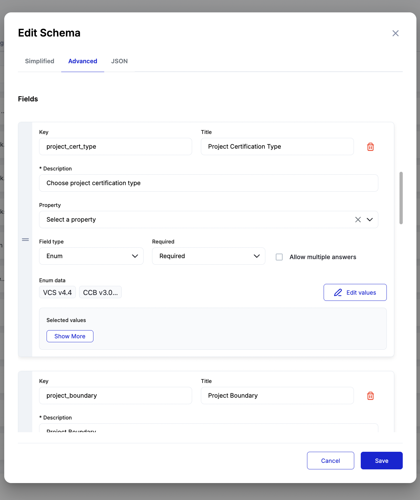
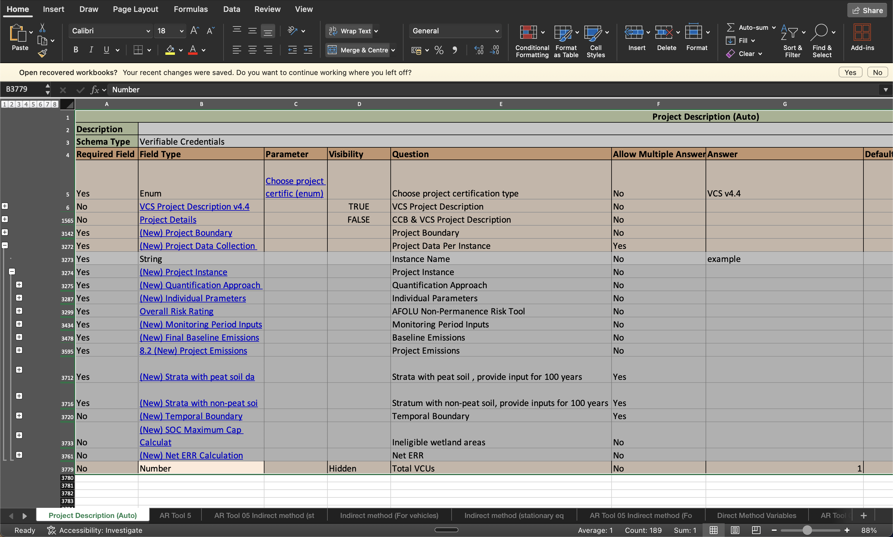
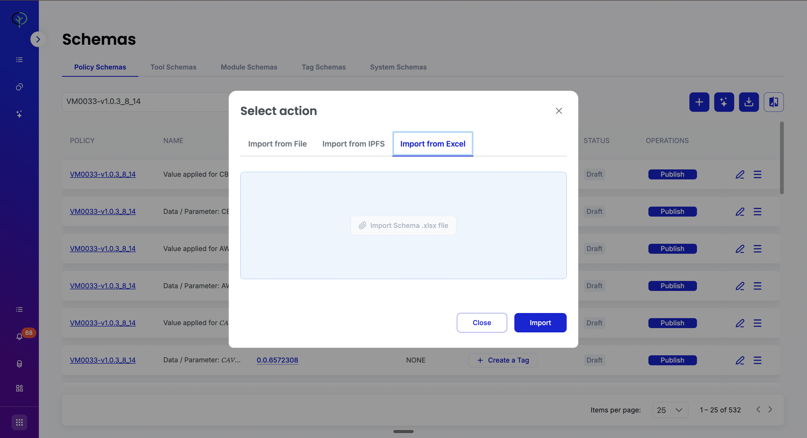
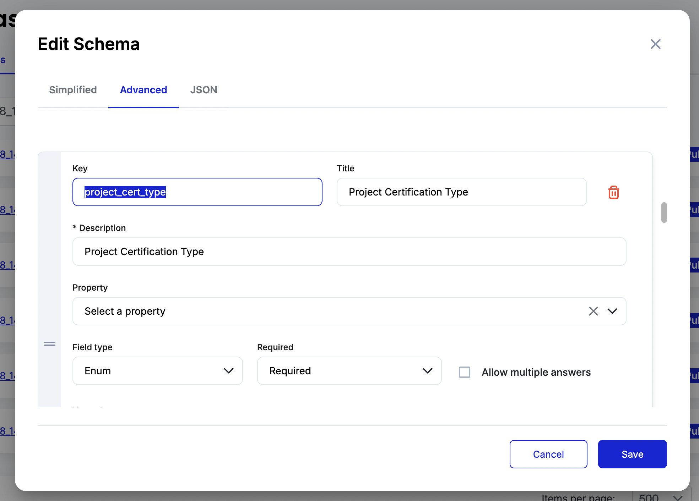

# Chapter 9: Project Design Document (PDD) Schema Development

This chapter teaches you how to build Guardian schemas step-by-step using the Excel-first approach for PDD implementation. You'll learn the exact field-by-field process used for VM0033, translating methodology analysis from Part II into working Guardian schema structures.

By the end of this chapter, you'll know how to create the [VM0033 PDD schema](../../_shared/artifacts/PDD-schema.xlsx) like structure yourself, understanding each Guardian field type, conditional logic implementation, and how methodology parameters become functional data collection forms.

## Guardian Schema Development Process

Complex Guardian schemas can be built using Excel templates that define the data structure, and then imported into Guardian. The [schema template](../../_shared/artifacts/schema-template-excel.xlsx) shows all available field types and their configuration options.

**Alternative Schema Building Methods:**
- **Excel-first approach** (recommended for complex methodologies): Design in Excel, then import - covered in this chapter
- **Guardian UI approach**: Build directly in Guardian interface - see [Creating Schemas Using UI](../../../guardian/standard-registry/schemas/creating-system-schema-using-ui.md)


Excel-first approach also enables easier collaboration with carbon domain experts and non-technical stakeholders to provide better feedback with back-and-forth when schemas are complex.




### Schema Template Structure

Every Guardian schema follows this Excel structure:

| Required Field | Field Type             | Parameter         | Visibility        | Question             | Allow Multiple Answers | Answer        |
| -------------- | ---------------------- | ----------------- | ----------------- | -------------------- | ---------------------- | ------------- |
| Yes/No         | String/Number/Enum/etc | Reference to enum | TRUE/FALSE/hidden | User-facing question | Yes/No                 | Default value |

**Field Configuration Meaning**:
- **Required Field**: Whether users must complete this field before submission
- **Field Type**: Data type (String, Number, Date, Enum, Boolean, Sub-Schema, etc.)
- **Parameter**: Reference to enum options or calculation parameters
- **Visibility**: Field display conditions (TRUE=always visible, FALSE=hidden unless condition met)
- **Question**: Text that users see as the field label
- **Allow Multiple Answers**: Whether field accepts multiple values
- **Answer**: Default value or example shown to users

## Building the Primary Schema Structure

Let's build a PDD schema step-by-step, starting with the main schema definition like VM0033's "Project Description (Auto)" tab.



### Step 1: Create Main Schema Header

Start your Excel file with these header rows:

```excel
Row 1: Project Description (Auto)
Row 2: Description
Row 3: Schema Type | Verifiable Credentials
Row 4: Required Field | Field Type | Parameter | Visibility | Question | Allow Multiple Answers | Answer
```

This establishes your schema as a Verifiable Credentials type that Guardian will process into on-chain records.

### Step 2: Add Certification Pathway Selection

The first functional field should be your primary conditional logic driver. For VM0033, this is certification type selection:

```excel
Row 5: Yes | Enum | Choose project certific (enum) | | Choose project certification type | No | VCS v4.4
```

This creates an enum field that determines which additional requirements appear. The parameter reference "Choose project certific (enum)" points to a separate enum tab defining the options.

**Create the Enum Tab**: Add a new worksheet named "Choose project certific (enum)" with(sheet names might be trimmed to accomodate excel's limitations):

```excel
Schema name | Project Description (Auto)
Field name | Choose project certification type
Loaded to IPFS | No
VCS v4.4 |
CCB v3.0 & VCS v4.4 |
```

### Step 3: Add Conditional Sub-Schemas

Based on the certification selection, different sub-schemas should appear. Add conditional schema references:

```excel
Row 6: No | VCS Project Description v4.4 | | TRUE | VCS Project Description | No |
Row 7: No | CCB | | FALSE | CCB & VCS Project Description | No |
```

The VCS sub-schema always appears (TRUE visibility), while CCB appears only when CCB certification is selected (FALSE = conditional visibility based on enum selection).

### Step 4: Create Sub-Schema Structures

#### VCS Project Description Sub-Schema

Create a new worksheet "VCS Project Description v4.4" with basic project information:

```excel
VCS Project Description v4.4
Description
Schema Type | Sub-Schema
Required Field | Field Type | Parameter | Visibility | Question | Allow Multiple Answers | Answer
Yes | String | | | Project title | No | example
Yes | String | | | Project ID | No | example
Yes | URL | | | Project Website | No | https://example.com
Yes | Date | | | Start Date | No | 2000-01-01
Yes | Date | | | End Date | No | 2000-01-01
```

#### CCB Sub-Schema (Conditional)

Create "CCB" worksheet for additional community/biodiversity requirements:

```excel
CCB
Description
Schema Type | Sub-Schema
Required Field | Field Type | Parameter | Visibility | Question | Allow Multiple Answers | Answer
Yes | String | | | CCB Standard | No | example
Yes | String | | | CCB Project Type | No | example
Yes | Date | | | Auditor Site Visit Start Date | No | 2000-01-01
```

## Implementing Project Information Fields

### Geographic Data Capture

Add geographic information fields to your main schema or sub-schema:

```excel
Yes | Number | | | Latitude (Decimal Degrees) | No | 1
Yes | Number | | | Longitude (Decimal Degrees) | No | 1
Yes | Number | | | Acres/Hectares | No | 1
Yes | Enum | AcresHectares (enum) | | Acres/Hectares | No | Acres
```

Create the unit selection enum tab "AcresHectares (enum)":

```excel
Schema name | Project Description (Auto)
Field name | Acres/Hectares
Loaded to IPFS | No
Acres |
Hectares |
```

### Project Timeline Fields

```excel
Yes | Date | | | Project Start Date | No | 2000-01-01
Yes | Date | | | Project End Date | No | 2000-01-01
Yes | Number | | | Crediting Period Length (years) | No | 10
```

## Adding Methodology-Specific Parameters

Now translate your Part II parameter analysis into Guardian fields. For VM0033's biomass parameters:

### Step 1: Add Parameter Collection Fields

```excel
Yes | String | | | Stratum number | No | example
Yes | Number | | | Area of stratum (ha) – Ai,t | No | 1
Yes | Number | | | Biomass density (t d.m. ha-1) | No | 1
Yes | String | | | Data source for biomass density | No | example
Yes | String | | | Justification for parameter selection | No | example
```

### Step 2: Add Calculation Method Selection

```excel
Yes | Enum | Which method did you us (enum) | | Which method did you use for estimating change in carbon stock in trees? | No | Between two points of time
```

Create the method enum tab:

```excel
Schema name | Project Description (Auto)
Field name | Which method did you use for estimating change in carbon stock in trees?
Loaded to IPFS | No
Between two points of time |
Difference of two independent stock estimations |
```

### Step 3: Add Method-Specific Parameter Fields

Add conditional fields that appear based on method selection:

```excel
No | Number | | FALSE | Mean annual change in carbon stock (t CO2e yr-1) | No | 1
No | Number | | FALSE | Carbon fraction of tree biomass (CF_TREE) | No | 1
No | Number | | FALSE | Default mean annual increment (Δb_FOREST) | No | 1
```

These fields have FALSE visibility, meaning they appear conditionally based on the method selection enum.

## Integrating AR Tools and External Modules

### Adding AR Tool Integration

VM0033 uses AR Tool 14 for biomass calculations. Add tool integration:

```excel
Yes | AR Tool 14 | | | AR Tool 14 | No |
```

### Create AR Tool Sub-Schema

Create "AR Tool 14" worksheet for tool-specific parameters:

```excel
AR Tool 14
Description | Biomass estimation using AR Tool 14
Schema Type | Tool-integration
Tool | AR Tool 14
Tool Id | [tool message id if available]
Required Field | Field Type | Parameter | Visibility | Question | Allow Multiple Answers | Answer
Yes | Number | | | Tree height (m) | No | 1
Yes | Number | | | Diameter at breast height (cm) | No | 1
Yes | Number | | | Wood density (g cm-3) | No | 1
```

## Implementing Baseline and Project Calculations

### Baseline Scenario Fields

Create a sub-schema for baseline emissions:

```excel
Yes | (New) Final Baseline Emissions | | | Baseline Emissions | No |
```

Create "(New) Final Baseline Emissions" worksheet:

```excel
(New) Final Baseline Emissions
Description
Schema Type | Sub-Schema
Required Field | Field Type | Parameter | Visibility | Question | Allow Multiple Answers | Answer
Yes | Number | | | Year t | No | 1
Yes | String | | | Stratum number | No | example
Yes | Enum | It's a baseline scenari (enum) | | It's a baseline scenario or project scenario? | No | Baseline scenario
Yes | Number | | | Mean annual change in carbon stock in trees (t CO2e yr-1) | No | 1
```

### Project Emissions Structure

Similarly create project emissions calculation fields:

```excel
Yes | (New) Project Emissions | | | Project Emissions | No |
```

## Advanced Field Types and Features

### Auto-Calculate Fields

For calculated results that update automatically:

```excel
No | Auto-Calculate | | | Total Emission Reductions (t CO2e) | No | 2
```

### File Upload Fields

For evidence documentation:

```excel
Yes | Image | | | Site photograph | No | ipfs://05566a658a44c6f747b5f82a2de1e0bf
No | String | | | Document description | No | example
```

### Help Text Fields

Add contextual guidance:

```excel
No | Help Text | {"color":"#FF0000","size":"14px"} | | Parameter Help | No | This parameter represents...
```

### Hidden Fields for System Use

```excel
No | String | | Hidden | Internal project ID | No | example
```

## Conditional Logic Implementation

### Simple Conditional Visibility

Use TRUE/FALSE in the Visibility column:
- **TRUE**: Always visible
- **FALSE**: Visible only when referenced condition is met
- **Hidden**: Never visible to users (system fields)

### Complex Conditional Logic

For multiple conditions, Guardian evaluates enum selections to determine field visibility. The FALSE visibility fields become visible when their referenced enum is selected appropriately.

## Quality Control and Validation

### Required Field Validation

Use "Yes" in Required Field column to enforce completion:

```excel
Yes | String | | | Project Developer Name | No | example
```

### Data Type Validation

Guardian automatically validates based on Field Type:
- **Number**: Only accepts numeric values
- **Date**: Validates date format (2000-01-01)
- **Email**: Validates email format
- **URL**: Validates URL format

### Pattern Validation

For custom validation patterns:

```excel
Yes | Pattern | [0-9]{4} | | Four-digit year | No | 2024
```

## Testing Your Schema Structure

### Validation Checklist

Before importing to Guardian, verify:
- [ ] All enum references have corresponding enum tabs
- [ ] Required Field column uses only Yes/No
- [ ] Field Types match Guardian template options
- [ ] Visibility logic is consistent (TRUE/FALSE/Hidden)
- [ ] Sub-schema references point to existing worksheets
- [ ] Parameter calculations map to methodology equations

### Import Testing and Schema Refinement

1. Save Excel file with proper structure
2. Import to Guardian
3. Test conditional logic with different selections
4. Validate auto-calculate fields
5. **Review and rename field keys** for meaningful calculation code
6. Update the schema ID in relevant policy workflow block



#### Important: Field Key Management

When Guardian imports Excel schemas, it generates default field keys that may not be meaningful for calculation code. For example:
- Excel field "Biomass density (t d.m. ha⁻¹)" becomes field key "G5" as per excel cell it was found in
- Default keys make calculation code harder to read and maintain

**Best Practice**: After import, open the schema in Guardian UI to rename field keys:

1. Navigate to schema management in Guardian
2. Open your imported schema for editing
3. Review each field's "Field Key" property
4. Rename keys to be calculation-friendly:
   - `biomass_density_stratum_i` instead of `field0`
   - `carbon_stock_baseline_t` instead of `carbonStockBaselineT`
   - `emission_reduction_total` instead of `emissionReductionTotal`



**Why This Matters**: Meaningful field keys make calculation code much easier to write and maintain:

```javascript
// With good field keys
const totalEmissions = data.biomass_density_stratum_i * data.area_hectares;

// With default keys
const totalEmissions = data.field0 * data.field1; // What do these represent?
```

## Connecting to Monitoring Schemas

Your PDD schema establishes the foundation that monitoring schemas build upon. Key connections:

### Parameter Continuity

Ensure PDD parameters have corresponding monitoring equivalents:
- PDD: Initial biomass density estimate
- Monitoring: Annual biomass density measurements

### Calculation Consistency

Use same parameter names and calculation approaches:
- PDD parameter key: `biomass_density_initial`
- Monitoring parameter key: `biomass_density_year_t`

### Conditional Logic Alignment

Method selections in PDD should drive monitoring parameter requirements:
- Direct method PDD → Direct measurement monitoring fields
- Indirect method PDD → Indirect calculation monitoring fields

## Best Practices Summary

**Start Simple**: Begin with basic project information, then add complexity systematically.

**Test Incrementally**: Validate each section before adding the next level of complexity.

**Use Sub-Schemas**: Break complex sections into manageable sub-schema components.

**Plan Conditionals**: Design conditional logic to reduce user interface complexity while maintaining requirement coverage.

**Link to Analysis**: Every parameter should trace back to specific methodology requirements from Part II analysis.

**Validate with Stakeholders**: Test schema workflows with actual Project Developers and VVBs before production deployment.

The next chapter builds on this PDD foundation to create monitoring schemas that handle time-series data collection and calculation updates over project lifetimes.